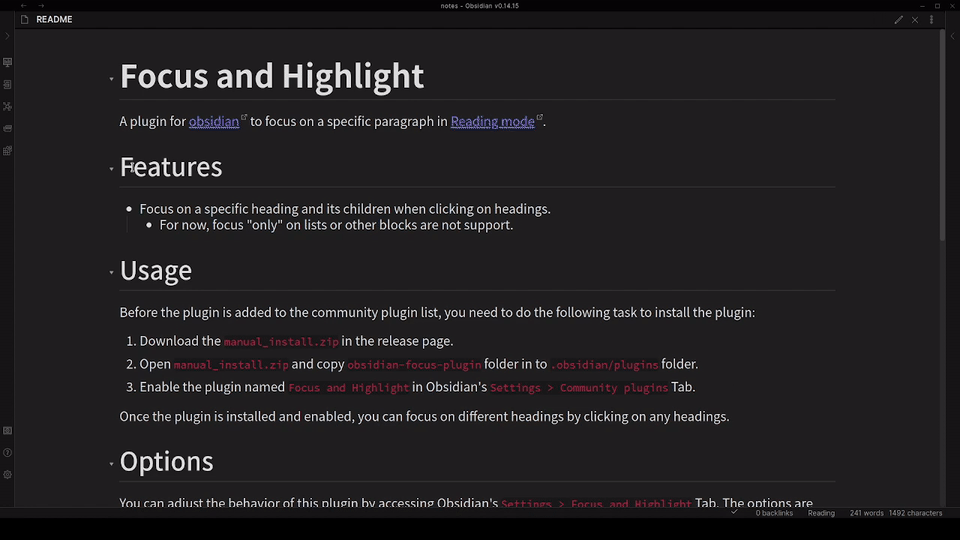
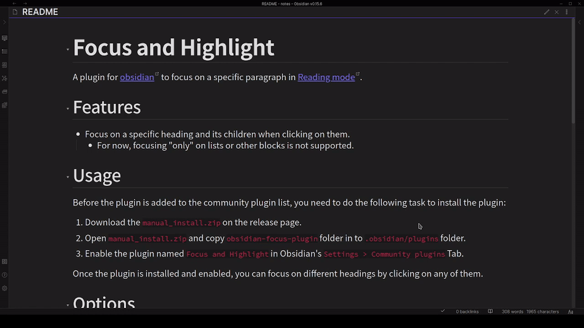

# Focus and Highlight
A plugin for [obsidian](https://obsidian.md/) to focus on a specific paragraph in [Reading mode](https://help.obsidian.md/How+to/Read+and+edit+modes).

## Features
- Focus on a specific heading and its children when clicking on them.
	- Start from v1.2.0, you can also focus on a specific paragraph by change the setting `Content Behavior` to `Only Focus the Element`.
	- Start from v1.2.0, you can focus by clicking the children of a heading.

## Usage
1. The plugin is now available in community plugins list! You can download the plugin directly through Obsidian's `Settings > Community plugins` Tab.
	- You can also install with [BRAT](https://github.com/TfTHacker/obsidian42-brat), with the repository name `nagi1999a/obsidian-focus-plugin`.
2. Enable the plugin named `Focus and Highlight` in Obsidian's `Settings > Community plugins` Tab.

Once the plugin is installed and enabled, you can focus on different headings by clicking on any of them.

## Options
You can adjust the behavior of this plugin by accessing Obsidian's `Settings > Focus and Highlight` Tab.

### Clear Method
This option affects the way to clear the focus state.

#### Click Again
Clear the focus state by clicking again on the focused heading.

#### Click Outside
Clear the focus state by clicking on the blank area at the left or right side of the reading area, which may not work correctly when `Settings > Editor > Readable line length` is turned off.

### Focus Scope
This option affects the scope of the focus state.

#### Only One Block
Focus only the block you clicked on.

#### Also the Content
Focus the block you clicked on and related contents.

### Content Behavior
This option affects the behavior when clicking on the content elements, e.g. pure text, callout block, etc.

#### Only Focus the Element
Focus only the element you clicked on.

#### Focus Related Contents
Focus the element you clicked on and related contents.

### Style Settings
With the [Style Settings](https://github.com/mgmeyers/obsidian-style-settings) plugin installed and enabled, you can further customize some visual properties under `Settings > Style Settings > Focus and Highlight`.

#### Dim Opacity
Set the opacity of dimmed elements. Default is 0.1.

#### Dim Speed
Set the speed of the animation in seconds. Default is 0.5.

## Discussion

### Behavior under Mutiple Panes
The plugin now supports multi-pane scenarios. Different panes will be able to focus on their headings, as the following GIF shows.

### Issues
If you encounter any problems or have suggestions about the plugin, please feel free to open issues.

### TODO
- [ ] Add support in edit mode.
### Support
> [!NOTE] Maintain a plugin is not an easy task.
> If you like this plugin, please consider the following methods to support the author:
> 1. Give me a star!
> 2. [Buy me a coffee](https://www.buymeacoffee.com/nagi1999a)!